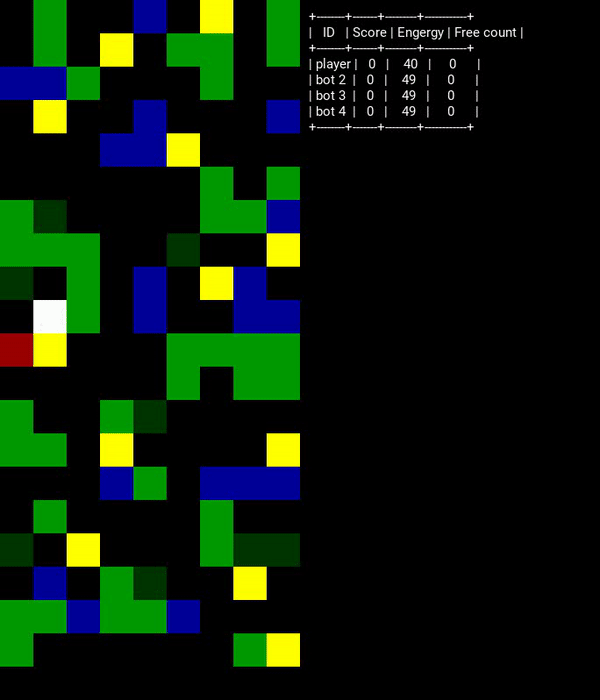

# Reinforcement-Learning-Gold-Miner
Reinforcement learning fsoft's competition 

## Installation
```bash
   git clone https://github.com/maycuatroi/Reinforcement-Learning-Gold-Miner
   cd Reinforcement-Learning-Gold-Miner
   python -m pip install -r requirements.txt
   python scripts/TrainingClient.py
```

## Wrap game to openAI enviroment:


## Visualize :

Create sample code for visualize game:


   
## Plan :

1. Enviroment :
   * [x] Refine enviroment : Wrap game to openAI enviroment [sample code](scripts/run_envs.py)
2. Learning model :
   * [x] Deep Q Network [source](src/Model/DQNModel.py)  [paper](https://arxiv.org/abs/1312.5602)
   - [ ] Double DQN [paper](http://arxiv.org/abs/1509.06461)
   - [ ] Deep Deterministic Policy Gradient (DDPG) [paper](http://arxiv.org/abs/1509.02971)
   - [ ] Continuous DQN (CDQN or NAF) [paper](http://arxiv.org/abs/1603.00748)
   - [ ] Cross-Entropy Method (CEM) [paper](http://learning.mpi-sws.org/mlss2016/slides/2016-MLSS-RL.pdf)
   - [ ] Dueling network DQN (Dueling DQN) [paper](https://arxiv.org/abs/1511.06581)
   - [ ] Deep SARSA [paper](http://people.inf.elte.hu/lorincz/Files/RL_2006/SuttonBook.pdf)
   - [ ] Asynchronous Advantage Actor-Critic (A3C) [paper](http://arxiv.org/abs/1602.01783)
   - [ ] Proximal Policy Optimization Algorithms (PPO) [paper](https://arxiv.org/abs/1707.06347)
3. Release :
   - [ ] Docker package
   - [ ] Submit code template
